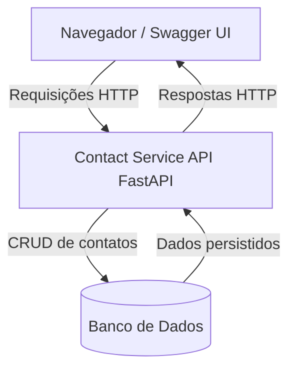

# Contact Service API

Este projeto é um serviço de agenda de contatos que oferece uma API para gerenciar contatos. A API permite a inclusão de um contato, consulta de um contato específico e listagem de todos os contatos cadastrados.

## Estrutura do Projeto

```
├─ contact_service
├── src
│    ├─ main.py            # Ponto de entrada da aplicação
│    ├─ models.py          # Modelos do serviço
│    └─ routes.py          # Rotas dos endpoints
│    └─ graphql_gateway.py # Gateway GraphQL
│    └─ schema_graphql.py  # Schema GraphQL  
├── Dockerfile           # Instruções para construir a imagem Docker
├─ README.md              # Documentação do projeto (agora na raiz do repositório)
└─ docker-compose.yml     # Responsavel por orquestrar os serviços
```

## Diagrama de Arquitetura



## Requisitos

- Python 3.13.3 ou superior
- Docker (opcional, para execução em container)

## Instalação

1. Clone o repositório:
   ```
   git clone <URL_DO_REPOSITORIO>
   cd contact_service
   ```

2. Instale as dependências (se não estiver usando Docker):
   ```
   pip install fastapi uvicorn
   ```

## Execução

### Usando Docker

Para executar a aplicação usando Docker, execute o seguinte comando na raiz do projeto:

```
docker build -t contact_service .
docker run -d -p 8000:8000 contact_service
```

### Sem Docker

Para executar a aplicação diretamente, use o seguinte comando:

```
uvicorn src.main:app --host 0.0.0.0 --port 8000
```

## Endpoints

- `POST /contato`: Adiciona um novo contato.
- `GET /contato/{contato_id}`: Consulta um contato específico pelo ID.
- `GET /contatos`: Lista todos os contatos cadastrados.

## Contribuição

Contribuições são bem-vindas! Sinta-se à vontade para abrir uma issue ou enviar um pull request.
